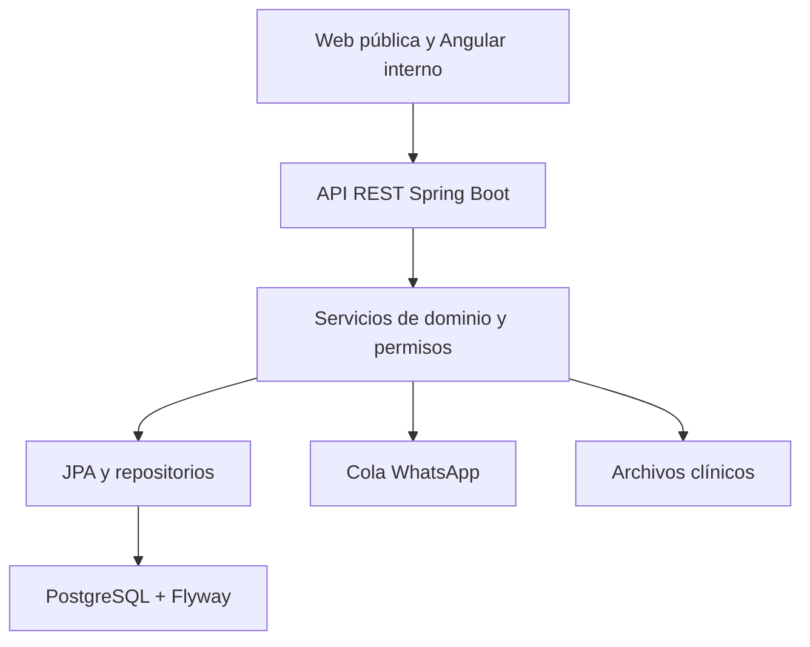
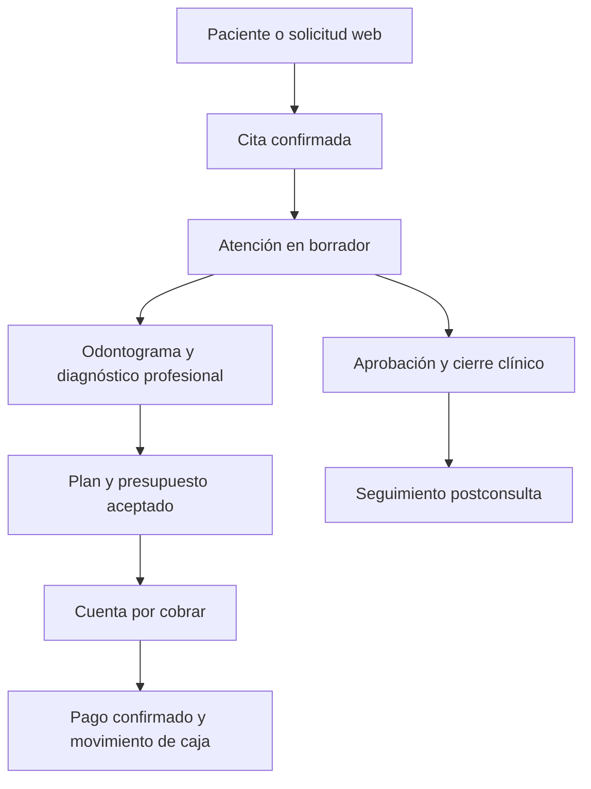

# Arquitectura del Sistema Dental Americana

## Capas

- **Angular 21:** aplicación responsive para PC, tablet y móvil; página pública y panel interno.
- **Spring Boot:** reglas clínicas, financieras, seguridad, auditoría y APIs.
- **PostgreSQL:** fuente única de datos transaccionales.
- **Flyway:** once migraciones ordenadas, repetibles en un ambiente nuevo.
- **Archivos:** ruta configurable; en producción debe montarse un volumen privado.

## Dominios

| Dominio | Responsabilidad |
|---|---|
| Seguridad | JWT, usuarios, roles, permisos, bloqueo y auditoría |
| Pacientes | Identidad, contacto, responsable, antecedentes, alergias, fármacos y archivos |
| Agenda | Horarios, disponibilidad, citas, conflictos y solicitudes web |
| Clínica | Historia, signos vitales, examen, diagnóstico profesional, plan, evolución y alta |
| Odontograma | Dentición permanente/infantil, pieza, superficie, condición y aprobación |
| Tratamientos | Catálogo, plan, presupuesto, aceptación y evolución |
| Finanzas | Cuentas por cobrar, pagos, gastos, movimientos, caja, cierre y reporte |
| Mensajería | Conversaciones, cola, confirmaciones, webhook y seguimiento postconsulta |
| Copiloto | Resúmenes y borradores supervisados con fuente y trazabilidad |
| Administración | Configuración, auditoría consultable e indicadores |

## Flujo clínico y financiero

## Estados que protegen la información

- Una atención comienza como `BORRADOR`; finalizada ya no se edita mediante el flujo normal.
- El odontograma requiere `APROBADO` antes de cerrar la atención cuando fue registrado.
- El plan genera cuenta por cobrar solo al pasar a `ACEPTADO`.
- Pago y gasto se registran dentro de una caja abierta y con confirmación explícita.
- El seguimiento con alerta no diagnostica; queda en `ALERTA` hasta revisión.
- Un borrador de IA solo pasa de `BORRADOR` a `APROBADO` o `RECHAZADO`.
- La solicitud pública solo se marca `AGENDADO` si se vincula con una cita existente.

## Seguridad

Cada endpoint interno exige JWT y un permiso específico. Los datos clínicos y financieros no se exponen en rutas públicas. Las operaciones sensibles usan versión optimista para evitar sobrescrituras. La auditoría registra usuario, acción, recurso, fecha, resultado, IP y detalle seguro.

## IA supervisada

La fase actual usa un generador determinista basado en datos estructurados para que el flujo sea verificable aun sin proveedor externo. Una futura conexión a un modelo debe mantener: mínimo dato necesario, fuente y versión, prohibición de diagnóstico autónomo, aprobación del odontólogo y auditoría.

## Contabilidad

El módulo financiero entrega control de caja, cuentas por cobrar, ingresos, gastos y CSV. No reemplaza libros contables, comprobantes electrónicos ni declaraciones de SUNAT. Una integración tributaria futura debe validarse con el contador y un proveedor autorizado.
